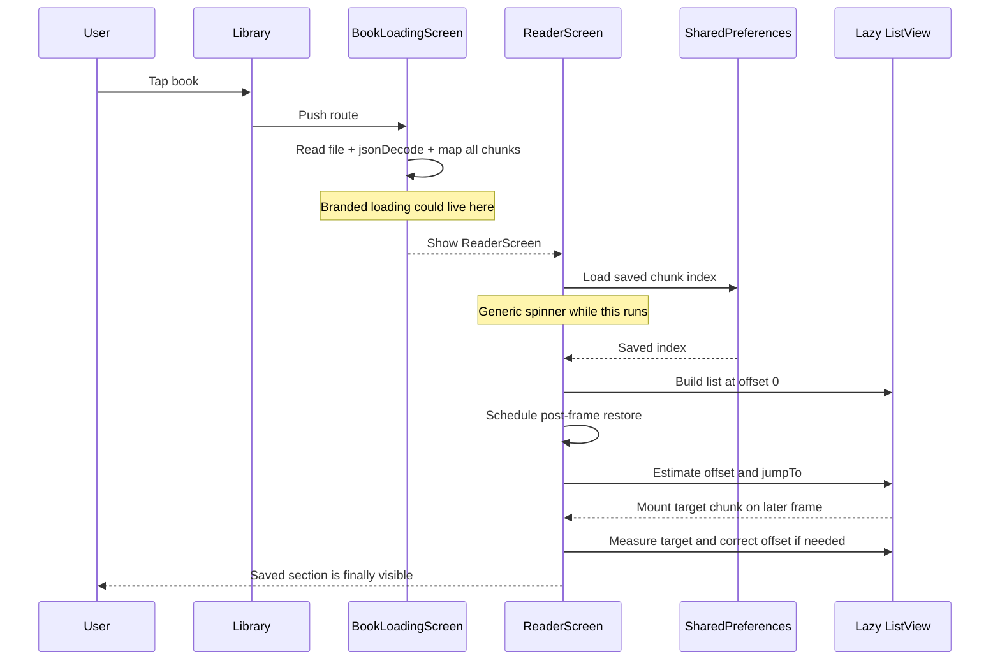

# Conformance Analysis: book_open_flow

**Analyzed**: `/Users/lakshaydagar/Desktop/Intrests/Gen_AI/Twitter for Books/lib/main.dart`
**Date**: 2026-08-27
**Scope**: Book-open flow from library tap through content loading and saved-position restoration

## Analysis Summary

The book-open experience is functionally correct but visually exposes an internal two-stage startup sequence. The first loading state only covers reading and parsing the book JSON; the saved reading position is loaded separately, and the reader is rendered once that preference load finishes before its scroll position has been restored. A post-frame restoration pass then estimates an offset, jumps the lazy list, waits for the target chunk to mount, and may correct the jump again. This explains the brief top-of-book frame followed by the saved section appearing; it is a medium-severity experience issue, not currently a data-integrity bug.

## Expected Behavior

- Tapping a book should immediately show an intentional reading-preparation screen.
- The preparation screen should hide file loading, JSON parsing, layout, and saved-position restoration.
- The reader should first become visible when its background chunks are laid out and the saved position is already centered on the focus line.
- The preparation state should feel designed, using a small animated book/page mark and short reading-related quotes.
- Once ready, the transition to the reader should be smooth and should not show a flash at the top of the book or a visible correction jump.

## Actual Behavior

- `LibraryScreen._openBook` pushes `BookLoadingScreen` immediately.
- `BookLoadingScreen` waits only for `BookLibrary.loadBook`.
- `BookLibrary.loadBook` reads the whole JSON source and then performs `jsonDecode` plus `Book.fromJson` mapping on the Flutter UI isolate.
- After the book future completes, `BookLoadingScreen` replaces its spinner with `ReaderScreen`.
- `ReaderScreen` starts a separate `_positionFuture` for `SharedPreferences`; while it is pending, it shows a second generic full-screen spinner.
- When the position future completes, the reader list is rendered at its default scroll offset, normally the beginning of the book.
- `_restorePosition()` is invoked from `build`, schedules a post-frame callback, and then restores the saved position after layout.
- For a far-away saved chunk that is not mounted by `ListView.builder`, restoration first uses an estimated chunk height, calls `jumpTo`, waits for the target to mount, and retries on later frames.
- The reader suppresses focus updates during restoration, but it does not suppress the visible reader itself.
- The current loader contains only a `CircularProgressIndicator`; it has no quote, icon motion, or readiness handoff animation.

## Divergences

| ID | Expected | Actual | Severity | Location |
|----|----------|--------|----------|----------|
| D1 | One cohesive loading state covers the entire open flow | Loading ends after book parsing; position loading and scroll restoration happen after the reader is shown | High | `lib/main.dart:584-599`, `793-849`, `1435-1455` |
| D2 | First visible reader frame is already at the saved position | Reader initially lays out at the top, then performs a post-frame `jumpTo` and possible correction | High | `lib/main.dart:1267-1353`, `1435-1455` |
| D3 | Opening work should not block visual smoothness | JSON decoding and conversion of every chunk occur synchronously on the UI isolate after file loading | Medium | `lib/main.dart:389-394`, `Book.fromJson` at `lib/main.dart:306-322` |
| D4 | Saved-position restoration should be stable and invisible | Lazy list mounting forces estimated offsets and up to 60 retry attempts at 16 ms intervals | Medium | `lib/main.dart:1004-1022`, `1278-1353` |
| D5 | Loading should communicate purposeful progress | Both loading paths show a generic spinner, with no branded transition | Low | `lib/main.dart:821-828`, `lib/main.dart:1439-1442` |

## Root Cause Analysis

### D1: The loading boundary ends before the open operation is complete

**Location**: `lib/main.dart:793-849` and `lib/main.dart:1435-1455`

`BookLoadingScreen` owns `_bookFuture` only. Once `BookLibrary.loadBook` finishes, it returns `ReaderScreen`. `ReaderScreen` then starts and awaits its own `_positionFuture`. These are separate asynchronous phases with separate UI states, so the app has no single notion of “the book is ready to display.”

**Root Cause**: Content loading, saved-position loading, and layout restoration were implemented in different widgets rather than as one readiness pipeline.

### D2: The reader is rendered before restoration is complete

**Location**: `lib/main.dart:1267-1353` and `lib/main.dart:1454-1455`

Once `_positionFuture` completes, `ReaderScreen.build` calls `_restorePosition()` but immediately returns the full reader scaffold and `ListView`. `_restorePosition()` only schedules work for a later frame. This means the first visible reader frame is necessarily allowed to use the default offset. The later callback can call `jumpTo`, which is the visible top-to-saved-section transition.

**Root Cause**: Restoration is treated as a background correction after rendering instead of a prerequisite for revealing the reader.

### D3: Full-book parsing happens on the UI isolate

**Location**: `lib/main.dart:389-394` and `lib/main.dart:306-322`

The file read is asynchronous, but the subsequent `jsonDecode` and mapping of every chunk into `BookChunk` objects are synchronous. The current generated Flood of Fire JSON is approximately 2.2 MB with 8,381 chunks, which makes this phase materially larger than the small prototype books. The exact cost should be measured on the Samsung device, but it is an avoidable source of frame pressure during opening.

**Root Cause**: The local converter produces a large JSON array and the reader parses the entire array on the UI isolate before the first reader screen.

### D4: Lazy rendering makes a distant restore inherently multi-frame

**Location**: `lib/main.dart:1278-1353` and `lib/main.dart:1533-1567`

`ListView.builder` only mounts chunks near the current viewport. If the saved index is far from zero, the target chunk has no render object yet. The code estimates a position using `_estimatedChunkExtent` or the average height of currently mounted chunks, jumps there, then retries until the target is mounted and measurable. The retry loop is bounded at 60 attempts, but it can still expose a correction lasting roughly up to 960 ms before accounting for file, preference, and frame delays.

**Root Cause**: The restoration algorithm needs the lazy list to discover and measure the target after the reader has already been made visible.

### D5: The current progress UI is technically correct but not designed for this transition

**Location**: `lib/main.dart:821-828` and `lib/main.dart:1439-1442`

The book-loading phase and position-loading phase both use a centered `CircularProgressIndicator`. There is no branded loading surface and no callback that tells the parent when the reader has finished restoration, so the app cannot replace the loading state at the right moment.

**Root Cause**: The existing loading UI was built as a fallback state for an asynchronous future, rather than as a deliberate book-opening experience.

## Behavior Flow



## Recommendations

### R1: Make book readiness one explicit pipeline

**Priority**: High

Keep the loading route alive until all prerequisites are complete: book JSON loaded and parsed, saved index loaded and clamped, chapter markers prepared, and the reader has completed its first layout/restoration pass. The loader should receive a readiness callback from the reader or the reader should expose a `Future<void>` that completes from `_finishRestoring()`.

### R2: Keep the reader hidden behind the designed loading surface during restoration

**Priority**: High

Render the reader behind an opaque loading layer or at zero opacity while `_isRestoring` is true. Only fade the loader out after the target chunk is measured and centered on the 40% focus line. This preserves lazy rendering and avoids adding a heavy pre-render of all 8,381 chunks.

### R3: Consolidate position loading before constructing the reader

**Priority**: High

Load `SharedPreferences` in the opening controller and pass the clamped initial index into `ReaderScreen`. This removes the reader's second generic spinner and lets restoration begin with a known target immediately.

### R4: Replace the generic spinner with a bounded branded opening animation

**Priority**: Medium

Use the no-text Broll mark with a subtle page-lift/scale or float animation and rotate through two or three short quotes. Keep the animation non-blocking and let readiness, rather than an arbitrary timer, determine when it exits; a short minimum display duration can prevent a flash on fast opens.

### R5: Measure before optimizing parsing

**Priority**: Medium

Add timestamps around file read, JSON decode, `Book.fromJson`, preference load, first reader layout, first target mount, and restore completion. If parsing is a meaningful part of the delay on-device, move JSON decoding/object construction to a background isolate or introduce a compact index plus on-demand chunk loading. For the first polish pass, fixing the visible restoration handoff is likely to produce the largest perceived improvement.
```
